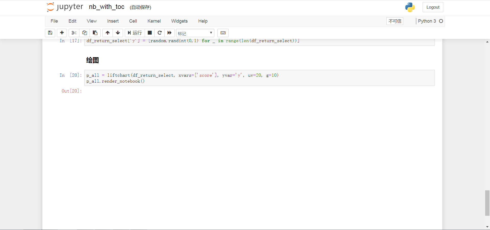

> (<span class="citeproc-not-found" data-reference-id="JiaxiangBU">**???**</span>)
> 有以下几个问题哈：
> 

Git bash 解决。只跑`$`

> 下面的都是在rstudio运行是吗？
> 
>     rmarkdown::render("jinxiaosong/nb2gitbook/bookdown.Rmd")
>     file.edit("jinxiaosong/nb2gitbook/build.R")
>     rstudioapi::viewer("jinxiaosong/nb2gitbook/bookdown.html")

是的。

> 你返回的链接中没有图片？
> 

是 notebook 的问题，这个图片在 notebook 本身没有显示出来。

``` r

```


