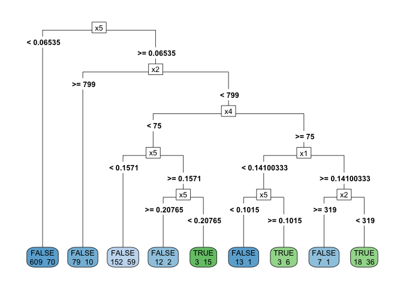
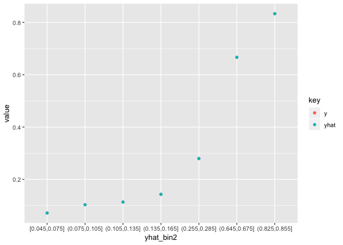

决策树
================
李家翔
2018-11-20

``` r
library(xfun)
library(tidyverse)
read_utf8('说明.txt') %>% 
    head
```

    ## [1] "song_help：需要构建决策树的数据"                                                                                                  
    ## [2] "x1:x5：    自变量"                                                                                                                
    ## [3] "y：        因变量"                                                                                                                
    ## [4] ""                                                                                                                                 
    ## [5] "目的：构建一颗好的决策树（尽量通多更多的人且逾期率在3%以下）"                                                                     
    ## [6] "注：x2中的“0”是缺失值，x5中的“9”是特殊的一个值（即命中x5==“9”的这几个样本没有调用x5变量，并不是缺失，而是没调用x5这个特征）"

我参考我之前做决策树的
[笔记](https://jiaxiangli.netlify.com/2018/01/machine-learning-with-tree-based-models-in-r/)

``` r
library(data.table)
```

    ## 
    ## Attaching package: 'data.table'

    ## The following objects are masked from 'package:dplyr':
    ## 
    ##     between, first, last

    ## The following object is masked from 'package:purrr':
    ## 
    ##     transpose

``` r
data <- 
    fread('song_help.csv',stringsAsFactors = T) %>% 
    mutate(y = y == 'bad')
```

``` r
library(psych)
```

    ## 
    ## Attaching package: 'psych'

    ## The following objects are masked from 'package:ggplot2':
    ## 
    ##     %+%, alpha

``` r
describe(data) %>% 
    as_tibble()
```

    ## Warning in FUN(newX[, i], ...): min里所有的参数都不存在; 回覆Inf

    ## Warning in FUN(newX[, i], ...): max里所有的参数都不存在；回覆-Inf

    ## # A tibble: 6 x 13
    ##    vars     n     mean       sd  median  trimmed      mad      min
    ## * <int> <dbl>    <dbl>    <dbl>   <dbl>    <dbl>    <dbl>    <dbl>
    ## 1     1  1096    0.108  4.87e-2  0.144    0.111    0.0270   0.0132
    ## 2     2  1096 1681.     5.66e+3 94      458.     139.       0     
    ## 3     3  1096 3075.     8.00e+3  0.1    979.       0.0741   0     
    ## 4     4  1096   68.3    7.73e+0 68       68.3      7.41    37     
    ## 5     5  1096    0.163  9.31e-1  0.0538   0.0593   0.0331   0.0066
    ## 6     6  1096  NaN     NA       NA      NaN       NA      Inf     
    ## # ... with 5 more variables: max <dbl>, range <dbl>, skew <dbl>,
    ## #   kurtosis <dbl>, se <dbl>

``` r
# Create the model
library(rpart)
mod <- rpart(formula = y ~ . 
             ,data = data
             ,method = "class"
             )
```

``` r
# Display the results
library(rpart.plot)
rpart.plot(x = mod, yesno = 2, type = 5, extra = 1,digits = 10)
```

<!-- -->

`digits`参考加上，否则图示会做近似处理，参考 [Stack
Overflow](https://stackoverflow.com/questions/31571248/rpart-rounding-values?answertab=active)

``` r
data %>% 
    summarise(
        node_1 = sum(x5 < 0.06535)
    )
```

    ##   node_1
    ## 1    679

``` r
data_addpred <- 
    data %>% 
    bind_cols(
        predict(mod,newdata = data) %>% 
        as_tibble() %>% 
        transmute(yhat = `TRUE`)
    ) %>% 
    mutate(yhat_bin = yhat < 0.03) %>% 
    select(y,yhat,yhat_bin)
```

``` r
data_addpred %>% 
    as_tibble()
```

    ## # A tibble: 1,096 x 3
    ##    y      yhat yhat_bin
    ##    <lgl> <dbl> <lgl>   
    ##  1 FALSE 0.103 FALSE   
    ##  2 FALSE 0.103 FALSE   
    ##  3 FALSE 0.103 FALSE   
    ##  4 FALSE 0.280 FALSE   
    ##  5 FALSE 0.103 FALSE   
    ##  6 FALSE 0.103 FALSE   
    ##  7 FALSE 0.103 FALSE   
    ##  8 FALSE 0.280 FALSE   
    ##  9 FALSE 0.103 FALSE   
    ## 10 TRUE  0.103 FALSE   
    ## # ... with 1,086 more rows

``` r
data_addpred %>% 
    mutate(yhat_bin2 = cut_width(yhat,0.03)) %>% 
    group_by(yhat_bin2) %>% 
    summarise(
        y = mean(y)
        ,yhat = mean(yhat)
    ) %>% 
    as_tibble() %>% 
    print %>% 
    gather(key,value,y:yhat) %>% 
    mutate(key = as.factor(key)) %>% 
    ggplot(aes(x=yhat_bin2,y=value,col=key)) +
        geom_point()
```

    ## # A tibble: 7 x 3
    ##   yhat_bin2          y   yhat
    ##   <fct>          <dbl>  <dbl>
    ## 1 [0.045,0.075] 0.0714 0.0714
    ## 2 (0.075,0.105] 0.103  0.103 
    ## 3 (0.105,0.135] 0.113  0.113 
    ## 4 (0.135,0.165] 0.143  0.143 
    ## 5 (0.255,0.285] 0.280  0.280 
    ## 6 (0.645,0.675] 0.667  0.667 
    ## 7 (0.825,0.855] 0.833  0.833

<!-- -->

晓松，这个数据看来不支持0.03这么低的bin，你看最低都是0.045。
