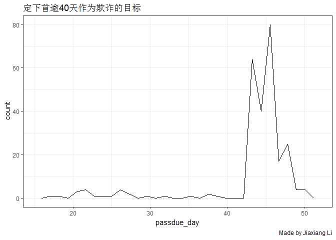

anti fraud
================

``` r
knitr::opts_chunk$set(warning = FALSE, message = FALSE)
```

``` r
list.files()
```

    ## [1] "ah_data_base.csv"   "ah_data_base02.csv" "ah_data_base03.csv"
    ## [4] "ah_data_base04.csv" "note.md"            "note.Rmd"          
    ## [7] "note_files"         "song_heop_2.zip"    "维度解释.txt"

``` r
library(xfun)
read_utf8('维度解释.txt')
```

    ##  [1] "<U+FEFF>user_id：申请人唯一编码" "name：申请人姓名"               
    ##  [3] "phone_no：手机号"                "id_no：身份证号"                
    ##  [5] "passdue_day：是否逾期（均逾期）" "registered_from：注册渠道"      
    ##  [7] "registered_at：注册时间"         "applied_at：申请时间"           
    ##  [9] "province：省份证（省）"          "phone_province：手机（省）"     
    ## [11] "city：省份证（市）"              "phone_city：手机（市）"         
    ## [13] "district：省份证（区/县）"

``` r
library(data.table)
data <- fread('ah_data_base.csv',encoding = 'UTF-8')
data <- fread('ah_data_base.csv',encoding = 'UTF-8')
data02 <- fread('ah_data_base02.csv',encoding = 'UTF-8')
data03 <- fread('ah_data_base03.csv',encoding = 'UTF-8')
data04 <- fread('ah_data_base04.csv',encoding = 'UTF-8')
```

``` r
library(tidyverse)
data %>% 
    group_by(province) %>% 
    count()
```

    ## # A tibble: 26 x 2
    ## # Groups:   province [26]
    ##    province           n
    ##    <chr>          <int>
    ##  1 安徽省             1
    ##  2 北京市             3
    ##  3 福建省            13
    ##  4 甘肃省             1
    ##  5 广西壮族自治区     6
    ##  6 贵州省             2
    ##  7 海南省             6
    ##  8 河北省             1
    ##  9 河南省            35
    ## 10 黑龙江省          23
    ## # ... with 16 more rows

1.  <input type="checkbox" id="checkbox1" class="styled">`passdue_day`这个可以看到逾期天数和第几次逾期吗？
2.  第二个优先级滞后，我看到这里只有地理信息比较有用，整理省份的接壤数据，参考这个
    [GitHub文档](https://github.com/JiaxiangBU/tutoring/blob/master/zhangxinyue/border.md)

这里的接壤和的逻辑

1.  接壤 是为1 否为0
2.  隔海 如果两省份相隔1个海，那么也算接壤，即接壤=1，但是因为是一种特殊情况，所以需要把“隔海”这一项标记为1

最红我需要这样一个矩阵

``` r
library(tidyverse)
mtr_1 <- 
matrix(
    c(rep(1,9))
    ,nrow = 3
)
diag(mtr_1) <- 0
mtr_1[2,3] <- 0
mtr_1[3,2] <- 0
mtr_1 %>% 
    `colnames<-`(str_c('省份',letters[1:3])) %>% 
    `rownames<-`(str_c('省份',letters[1:3]))
```

    ##       省份a 省份b 省份c
    ## 省份a     0     1     1
    ## 省份b     1     0     0
    ## 省份c     1     0     0

这里表示每个省份的接壤情况，

1.  假设这个矩阵为A
2.  我的一个特征变量是B

我会构造这样一个变量 \(AB\)

``` r
data;data02
```

    ##      user_id name phone_no id_no passdue_day registered_from
    ##   1:       1    1        1     1           1             175
    ##   2:       2    2        2     2           1          158748
    ##   3:       3    3        3     3           1          158748
    ##   4:       4    4        4     4           1          158748
    ##   5:       5    5        5     5           1          158748
    ##  ---                                                        
    ## 254:     254  254      254   254           1          158748
    ## 255:     255  255      255   255           1          158748
    ## 256:     256  256      256   256           1          158748
    ## 257:     257  257      257   257           1          158748
    ## 258:     258  258      258   258           1          158748
    ##             registered_at      applied_at province phone_province   city
    ##   1: 2017-09-02T17:17:21Z 2018/9/25 16:40   四川省           辽宁 南充市
    ##   2: 2018-09-26T12:36:40Z 2018/9/26 12:40   福建省           福建 漳州市
    ##   3: 2018-09-30T00:34:06Z  2018/9/30 0:42   山西省           山西 晋中市
    ##   4: 2018-09-30T11:00:52Z 2018/9/30 11:03 黑龙江省           甘肃 大庆市
    ##   5: 2018-09-25T12:32:20Z 2018/9/25 12:43   河南省           河南 南阳市
    ##  ---                                                                    
    ## 254: 2018-09-30T11:36:25Z 2018/9/30 11:42   云南省           安徽 玉溪市
    ## 255: 2018-09-30T00:17:38Z  2018/9/30 0:28   江苏省           江苏 南通市
    ## 256: 2018-09-29T18:01:31Z 2018/9/29 18:03   江苏省           江苏 常州市
    ## 257: 2018-09-29T23:06:46Z 2018/9/29 23:12   云南省           吉林 曲靖市
    ## 258: 2018-09-30T12:27:26Z 2018/9/30 12:33   河南省           广东 焦作市
    ##      phone_city district
    ##   1:     辽阳市   嘉陵区
    ##   2:       漳州   漳浦县
    ##   3:       晋中   榆次区
    ##   4:     兰州市 让胡路区
    ##   5:     南阳市   社旗县
    ##  ---                    
    ## 254:     宣城市   华宁县
    ## 255:       南通   如东县
    ## 256:     常州市   武进区
    ## 257:     松原市   罗平县
    ## 258:       韶关   马村区

    ##      user_id name phone_no id_no passdue_day registered_from
    ##   1:       1    1        1     1          48             175
    ##   2:       2    2        2     2          48          158748
    ##   3:       3    3        3     3          43          158748
    ##   4:       4    4        4     4          45          158748
    ##   5:       5    5        5     5          48          158748
    ##  ---                                                        
    ## 254:     254  254      254   254          43          158748
    ## 255:     255  255      255   255          43          158748
    ## 256:     256  256      256   256          44          158748
    ## 257:     257  257      257   257          43          158748
    ## 258:     258  258      258   258          43          158748
    ##             registered_at      applied_at province phone_province   city
    ##   1: 2017-09-02T17:17:21Z 2018/9/25 16:40   四川省           辽宁 南充市
    ##   2: 2018-09-26T12:36:40Z 2018/9/26 12:40   福建省           福建 漳州市
    ##   3: 2018-09-30T00:34:06Z  2018/9/30 0:42   山西省           山西 晋中市
    ##   4: 2018-09-30T11:00:52Z 2018/9/30 11:03 黑龙江省           甘肃 大庆市
    ##   5: 2018-09-25T12:32:20Z 2018/9/25 12:43   河南省           河南 南阳市
    ##  ---                                                                    
    ## 254: 2018-09-30T11:36:25Z 2018/9/30 11:42   云南省           安徽 玉溪市
    ## 255: 2018-09-30T00:17:38Z  2018/9/30 0:28   江苏省           江苏 南通市
    ## 256: 2018-09-29T18:01:31Z 2018/9/29 18:03   江苏省           江苏 常州市
    ## 257: 2018-09-29T23:06:46Z 2018/9/29 23:12   云南省           吉林 曲靖市
    ## 258: 2018-09-30T12:27:26Z 2018/9/30 12:33   河南省           广东 焦作市
    ##      phone_city district
    ##   1:     辽阳市   嘉陵区
    ##   2:       漳州   漳浦县
    ##   3:       晋中   榆次区
    ##   4:     兰州市 让胡路区
    ##   5:     南阳市   社旗县
    ##  ---                    
    ## 254:     宣城市   华宁县
    ## 255:       南通   如东县
    ## 256:     常州市   武进区
    ## 257:     松原市   罗平县
    ## 258:       韶关   马村区

``` r
setequal(data %>% select(-passdue_day),data02 %>% select(-passdue_day))
```

    ## [1] TRUE

``` r
data03 %>% 
    ggplot(aes(x = passdue_day)) +
    geom_freqpoly() +
    theme_bw() +
    labs(
        title = '定下首逾40天作为欺诈的目标'
        ,caption = 'Made by Jiaxiang Li'
    )
```

<!-- -->

``` r
data03 %>% 
    group_by(phone_no) %>% 
    count()
```

    ## # A tibble: 36 x 2
    ## # Groups:   phone_no [36]
    ##    phone_no     n
    ##       <int> <int>
    ##  1      130     4
    ##  2      131     3
    ##  3      132     2
    ##  4      133     2
    ##  5      134     6
    ##  6      135     7
    ##  7      136    18
    ##  8      137    12
    ##  9      138     9
    ## 10      139    11
    ## # ... with 26 more rows

``` r
# 均匀分布 电话号码没什么用
```
