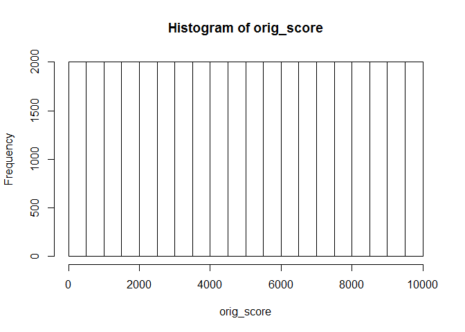
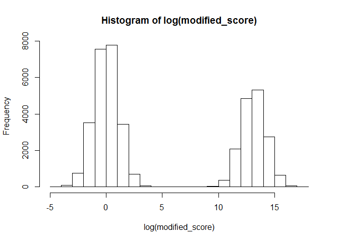

双峰分布构建
================

``` r
source(here::here("R/load.R"))
```

``` r
orig_score <- rep(1:10000,4) %>% sort
(length(orig_score) -> len_orig)
```

    ## [1] 40000

``` r
hist(orig_score)
```

<!-- -->

评分卡的分数，可以通过放缩**分数的间隔区间**，来实现分值的分布。

比如 `orig_score` 用 `modified_score` 的每个值来代替，

参考 [Stack Overflow](https://stackoverflow.com/a/11530222/8625228) 那么分布为

``` r
mu1 <- log(1)   
mu2 <- log(500000)
sig1 <- log(3)
sig2 <- log(3)
cpct <- 0.4   

bimodalDistFunc <- function (n,cpct, mu1, mu2, sig1, sig2) {
  y0 <- rlnorm(n,mean=mu1, sd = sig1)
  y1 <- rlnorm(n,mean=mu2, sd = sig2)

  flag <- rbinom(n,size=1,prob=cpct)
  y <- y0*(1 - flag) + y1*flag 
}

modified_score <- bimodalDistFunc(n=40000,cpct,mu1,mu2, sig1,sig2) %>% sort
hist(log(modified_score))
```

<!-- -->

如果逾期、成交这些字段区分度高才有意义。 不然顶多只是个特征变量。特征变量的效果，总是要被标签检验的。
