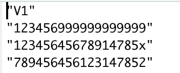
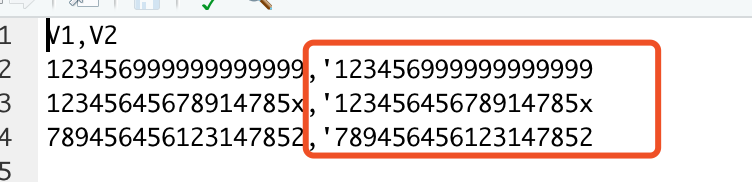
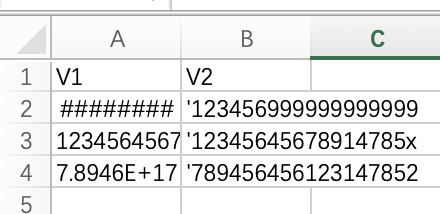

>
因为我导出有身份证这个字段  他就默认为数值了
就算是我设置为字符型或者是因子型  他导出还是数值型

```{r}
library(data.table)
library(tidyverse)
```

```{r}
tmp <- fread("1115_3.txt", encoding = 'UTF-8')
```
 
```{r}
tmp
```
 
 
```{r}
write.csv(tmp, "tmp_output.csv", row.names = F)
```

基本代码跑完后，字符没有改变。



那么Excel打开后为什么会改变呢？
我猜是Excel对单元格进行了自动处理。

1. 这对长期使用Excel的人来说是友好的
1. 但是对数据分析的人来说是不友好的

我当年用Excel的时候，有过一个技巧，如下。

```{r}
library(glue)
tmp %>% 
    mutate(V2 = glue("\'{V1}")) %>% 
    write_excel_csv('tmp_addcomma.csv')
```





我们检查下你的session info

```{r}
sessioninfo::session_info()
```

