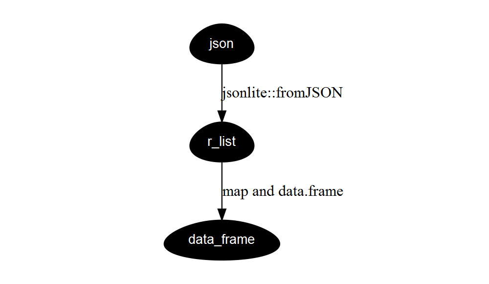

json manipulation using R
================
李家翔
2019-02-20

参考[Reference](someone/json/json.md) json 在 R 中处理方式遵循以下方式。

<!-- -->

``` r
suppressMessages(library(tidyverse))
read.csv("json.csv") %>% 
    mutate(var = as.character(var)) %>%
    # define in chr
    mutate(var = map(.x = var,.f = jsonlite::fromJSON)) %>% 
    mutate(var = map(var,as.data.frame)) %>% 
    unnest()
```

    ##   info_age name  sex
    ## 1       28 张三 <NA>
    ## 2       28 张三    f

参考[www.r-bloggers.com](https://www.r-bloggers.com/converting-a-list-to-a-data-frame/)

这里的两个 `mutate` 分别使用了模块化代码的思路，思路见图像。

模块化代码主要的目的是

1.  方便生产上迭代和修改
2.  减少代码之间的联动性，提高稳定性
3.  提高可读性

我在之前[Reference](../someone/json/json.Rmd)中也处理过 json
数据，但是代码不具备模块化，因此之后会多注意。
