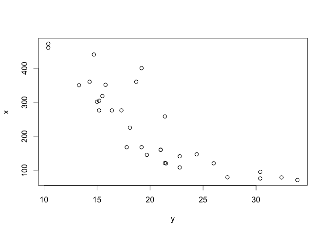

``` r
mtcars %>% head
```

    ##                    mpg cyl disp  hp drat    wt  qsec vs am gear carb
    ## Mazda RX4         21.0   6  160 110 3.90 2.620 16.46  0  1    4    4
    ## Mazda RX4 Wag     21.0   6  160 110 3.90 2.875 17.02  0  1    4    4
    ## Datsun 710        22.8   4  108  93 3.85 2.320 18.61  1  1    4    1
    ## Hornet 4 Drive    21.4   6  258 110 3.08 3.215 19.44  1  0    3    1
    ## Hornet Sportabout 18.7   8  360 175 3.15 3.440 17.02  0  0    3    2
    ## Valiant           18.1   6  225 105 2.76 3.460 20.22  1  0    3    1

``` r
y <- mtcars$mpg
x <- mtcars$disp
```

``` r
plot(y,x)
```

<!-- -->

``` r
lm(y ~ x) %>% summary()
```

    ## 
    ## Call:
    ## lm(formula = y ~ x)
    ## 
    ## Residuals:
    ##     Min      1Q  Median      3Q     Max 
    ## -4.8922 -2.2022 -0.9631  1.6272  7.2305 
    ## 
    ## Coefficients:
    ##              Estimate Std. Error t value Pr(>|t|)    
    ## (Intercept) 29.599855   1.229720  24.070  < 2e-16 ***
    ## x           -0.041215   0.004712  -8.747 9.38e-10 ***
    ## ---
    ## Signif. codes:  0 '***' 0.001 '**' 0.01 '*' 0.05 '.' 0.1 ' ' 1
    ## 
    ## Residual standard error: 3.251 on 30 degrees of freedom
    ## Multiple R-squared:  0.7183, Adjusted R-squared:  0.709 
    ## F-statistic: 76.51 on 1 and 30 DF,  p-value: 9.38e-10

``` r
lm(y ~ poly(x,10)) %>% summary()
```

    ## 
    ## Call:
    ## lm(formula = y ~ poly(x, 10))
    ## 
    ## Residuals:
    ##     Min      1Q  Median      3Q     Max 
    ## -3.1828 -1.7280 -0.1159  1.0308  3.6278 
    ## 
    ## Coefficients:
    ##                Estimate Std. Error t value Pr(>|t|)    
    ## (Intercept)    20.09062    0.38020  52.842  < 2e-16 ***
    ## poly(x, 10)1  -28.44097    2.15075 -13.224 1.19e-11 ***
    ## poly(x, 10)2    9.15235    2.15075   4.255 0.000353 ***
    ## poly(x, 10)3   -9.74460    2.15075  -4.531 0.000183 ***
    ## poly(x, 10)4   -0.01148    2.15075  -0.005 0.995792    
    ## poly(x, 10)5   -4.50020    2.15075  -2.092 0.048731 *  
    ## poly(x, 10)6   -0.47751    2.15075  -0.222 0.826443    
    ## poly(x, 10)7    3.06010    2.15075   1.423 0.169478    
    ## poly(x, 10)8    3.23277    2.15075   1.503 0.147706    
    ## poly(x, 10)9    0.11928    2.15075   0.055 0.956296    
    ## poly(x, 10)10  -0.99337    2.15075  -0.462 0.648923    
    ## ---
    ## Signif. codes:  0 '***' 0.001 '**' 0.01 '*' 0.05 '.' 0.1 ' ' 1
    ## 
    ## Residual standard error: 2.151 on 21 degrees of freedom
    ## Multiple R-squared:  0.9137, Adjusted R-squared:  0.8727 
    ## F-statistic: 22.24 on 10 and 21 DF,  p-value: 5.663e-09

``` r
lm(y ~ poly(x,19)) %>% summary()
```

    ## 
    ## Call:
    ## lm(formula = y ~ poly(x, 19))
    ## 
    ## Residuals:
    ##     Min      1Q  Median      3Q     Max 
    ## -3.0007 -0.9331  0.0001  0.5718  3.4166 
    ## 
    ## Coefficients:
    ##                Estimate Std. Error t value Pr(>|t|)    
    ## (Intercept)    20.09062    0.39167  51.294 1.98e-15 ***
    ## poly(x, 19)1  -28.44097    2.21564 -12.836 2.27e-08 ***
    ## poly(x, 19)2    9.15235    2.21564   4.131 0.001394 ** 
    ## poly(x, 19)3   -9.74460    2.21564  -4.398 0.000868 ***
    ## poly(x, 19)4   -0.01148    2.21564  -0.005 0.995951    
    ## poly(x, 19)5   -4.50020    2.21564  -2.031 0.065002 .  
    ## poly(x, 19)6   -0.47751    2.21564  -0.216 0.832984    
    ## poly(x, 19)7    3.06010    2.21564   1.381 0.192415    
    ## poly(x, 19)8    3.23277    2.21564   1.459 0.170222    
    ## poly(x, 19)9    0.11928    2.21564   0.054 0.957951    
    ## poly(x, 19)10  -0.99337    2.21564  -0.448 0.661893    
    ## poly(x, 19)11   0.54355    2.21564   0.245 0.810352    
    ## poly(x, 19)12   1.34286    2.21564   0.606 0.555750    
    ## poly(x, 19)13  -4.50100    2.21564  -2.031 0.064960 .  
    ## poly(x, 19)14   2.15493    2.21564   0.973 0.349950    
    ## poly(x, 19)15   2.08077    2.21564   0.939 0.366185    
    ## poly(x, 19)16   2.12840    2.21564   0.961 0.355698    
    ## poly(x, 19)17  -0.97140    2.21564  -0.438 0.668863    
    ## poly(x, 19)18  -1.01995    2.21564  -0.460 0.653501    
    ## poly(x, 19)19   0.62153    2.21564   0.281 0.783858    
    ## ---
    ## Signif. codes:  0 '***' 0.001 '**' 0.01 '*' 0.05 '.' 0.1 ' ' 1
    ## 
    ## Residual standard error: 2.216 on 12 degrees of freedom
    ## Multiple R-squared:  0.9477, Adjusted R-squared:  0.8649 
    ## F-statistic: 11.44 on 19 and 12 DF,  p-value: 5.419e-05

这里可以看到把 x 的 1到10次方都加入后，R^2 会越来越高。 如果 x 放到无穷，那么 R^2 =
100%，相当于影响关系和噪音都抓取了。

但是这其实使用的是泰勒公式展开，有兴趣你可以去查下。

另外，这种处理方法，很容易让这个 x 的组合变量是**过拟合**。

所以一般来说，大家考虑使用 交叉项，也就是 x1 和 x2 等的乘数，而不是这种暴力的提高x的次方。

更多地，你可以参考 James et al. (2013, 115)

<div id="refs" class="references">

<div id="ref-James2013An">

James, Gareth, Daniela Witten, Trevor Hastie, and Robert Tibshirani.
2013. *An Introduction to Statistical Learning with Applications in R*.
8th ed. Springer New York.

</div>

</div>
