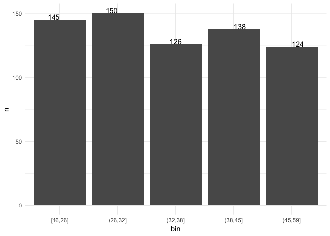

``` r
# R语言
library(tidyverse)
```

    ## ─ Attaching packages ───────────────────────── tidyverse 1.2.1 ─

    ## ✔ ggplot2 3.1.0       ✔ purrr   0.2.5  
    ## ✔ tibble  2.1.1       ✔ dplyr   0.8.0.1
    ## ✔ tidyr   0.8.2       ✔ stringr 1.4.0  
    ## ✔ readr   1.1.1       ✔ forcats 0.3.0

    ## ─ Conflicts ────────────────────────── tidyverse_conflicts() ─
    ## ✖ dplyr::filter() masks stats::filter()
    ## ✖ dplyr::lag()    masks stats::lag()

``` r
# 下面是年龄的那一列，家祥哥可以直接复制然后读图
age_hist <- read.table("refs/age.csv", header = T)
age <- age_hist %>%
    mutate(bin = cut_number(age, 5)) %>%
    group_by(bin) %>%
    summarise(n = n())
p <- ggplot(data = age, aes(x = bin, y = n))
p + theme_minimal() + geom_col() + geom_text(aes(label = n), vjust = "outward", hjust = "outward")
```

<!-- -->
