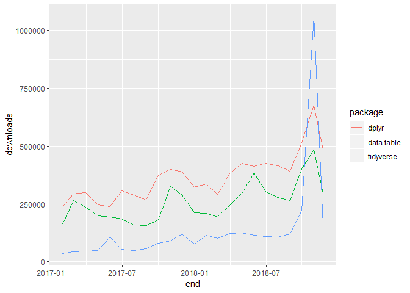

json
================
Jiaxiang Li
2018-11-23

``` r
library(data.table)
library(tidyverse)
```

    ## -- Attaching packages --------------------------------------- tidyverse 1.2.1 --

    ## √ ggplot2 3.1.0     √ purrr   0.2.5
    ## √ tibble  1.4.2     √ dplyr   0.7.8
    ## √ tidyr   0.8.2     √ stringr 1.3.1
    ## √ readr   1.1.1     √ forcats 0.3.0

    ## -- Conflicts ------------------------------------------ tidyverse_conflicts() --
    ## x dplyr::between()   masks data.table::between()
    ## x dplyr::filter()    masks stats::filter()
    ## x dplyr::first()     masks data.table::first()
    ## x dplyr::lag()       masks stats::lag()
    ## x dplyr::last()      masks data.table::last()
    ## x purrr::transpose() masks data.table::transpose()

``` r
data <- fread('test.csv')
```

``` r
# profvis::profvis(
#     for (i in 1:100) {
        data %>% 
            # two cols
            # json data is not std, clean it.
            mutate(var = str_replace_all(var,'""','\"')) %>% 
            mutate(var = map(.x = var,.f = jsonlite::fromJSON)) %>% 
            unnest()
```

    ## # A tibble: 107 x 18
    ##    cusnum 一般消费分期平台 银行个人业务 直销银行 财产保险 小额贷款公司
    ##     <int> <chr>            <chr>        <chr>    <chr>    <chr>       
    ##  1      1 3                1            1        1        1           
    ##  2      2 3                <NA>         1        <NA>     1           
    ##  3      3 5                <NA>         <NA>     1        1           
    ##  4      4 4                <NA>         1        <NA>     1           
    ##  5      5 2                <NA>         <NA>     <NA>     <NA>        
    ##  6      6 4                <NA>         <NA>     <NA>     <NA>        
    ##  7      7 3                <NA>         <NA>     <NA>     4           
    ##  8      8 5                <NA>         <NA>     <NA>     2           
    ##  9      9 2                <NA>         <NA>     1        1           
    ## 10     10 3                <NA>         <NA>     <NA>     <NA>        
    ## # ... with 97 more rows, and 12 more variables: P2P网贷 <chr>,
    ## #   大型消费金融公司 <chr>, 大数据金融 <chr>, 银行消费金融公司 <chr>,
    ## #   信用卡中心 <chr>, 网上银行 <chr>, 综合类电商平台 <chr>,
    ## #   互联网金融门户 <chr>, 银行小微贷款 <chr>, O2O <chr>, 融资租赁 <chr>,
    ## #   第三方服务商 <chr>

``` r
            # unnest, spread
            # as_tibble() %>% 
            # print %>% 
            # write_excel_csv('tmp.csv')
            # output
#     }
# )
```

1.  json code 可以参考 [7.30
    json格式文件清理成dataframe](https://jiaxiangli.netlify.com/2018/02/dplyr/)

<!-- end list -->

``` r
# profvis::profvis(
#     for (i in 1:100){
        data[, var := str_replace_all(var, '""', '\"')
        ][, {
            I <- list()
            for (i in 1:.N) {
                I[[i]] <- c(jsonlite::fromJSON(var[i]), cusnum = cusnum[i])
            }
            rbindlist(I, fill = T)        
        }]
```

    ## # A tibble: 107 x 18
    ##    一般消费分期平台 银行个人业务 直销银行 财产保险 小额贷款公司 P2P网贷
    ##    <chr>            <chr>        <chr>    <chr>    <chr>        <chr>  
    ##  1 3                1            1        1        1            2      
    ##  2 3                <NA>         1        <NA>     1            3      
    ##  3 5                <NA>         <NA>     1        1            15     
    ##  4 4                <NA>         1        <NA>     1            1      
    ##  5 2                <NA>         <NA>     <NA>     <NA>         <NA>   
    ##  6 4                <NA>         <NA>     <NA>     <NA>         5      
    ##  7 3                <NA>         <NA>     <NA>     4            12     
    ##  8 5                <NA>         <NA>     <NA>     2            14     
    ##  9 2                <NA>         <NA>     1        1            3      
    ## 10 3                <NA>         <NA>     <NA>     <NA>         5      
    ## # ... with 97 more rows, and 12 more variables: 大型消费金融公司 <chr>,
    ## #   cusnum <int>, 大数据金融 <chr>, 银行消费金融公司 <chr>,
    ## #   信用卡中心 <chr>, 网上银行 <chr>, 综合类电商平台 <chr>,
    ## #   互联网金融门户 <chr>, 银行小微贷款 <chr>, O2O <chr>, 融资租赁 <chr>,
    ## #   第三方服务商 <chr>

``` r
#     }
# )
```

# dplyr and data.table

``` r
library(packagefinder)
library(dlstats)
library(cranly)
library(tidyverse)
library(lubridate)
```

    ## 
    ## Attaching package: 'lubridate'

    ## The following objects are masked from 'package:data.table':
    ## 
    ##     hour, isoweek, mday, minute, month, quarter, second, wday,
    ##     week, yday, year

    ## The following object is masked from 'package:base':
    ## 
    ##     date

``` r
cran_stats(c('dplyr','data.table','tidyverse')) %>% 
    filter(year(end) >= 2017) %>% 
    ggplot(aes(x=end,y=downloads,col=package)) + 
    geom_line()
```

<!-- -->
