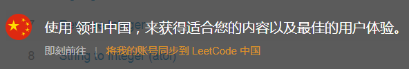
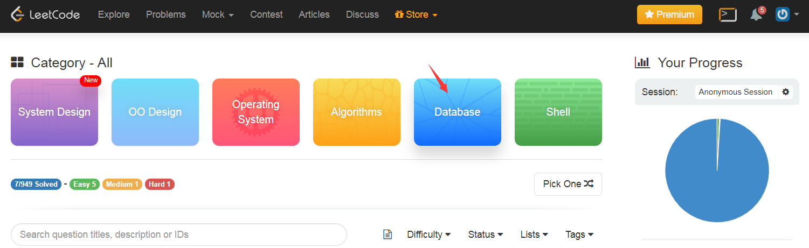
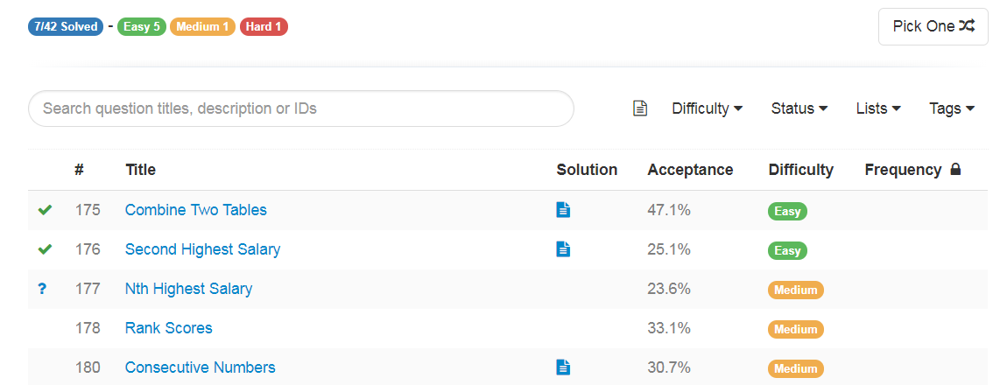

通过 Leecode 学习 sql相关语言，
相关教程可以参考
[这篇博客](https://jiaxiangli.netlify.com/2017/12/04/r-impala/)

打开
https://leetcode.com/

这里有中英文两个版本，可以按需选择。

登录以后，选择**DataBase**

根据下面的 Problem Set，选择 **EASY** 的开始学习，里面可以提交 Code，进行验证。
主要先注意 `JOIN` 和 `WHERE` 表达的练习。

